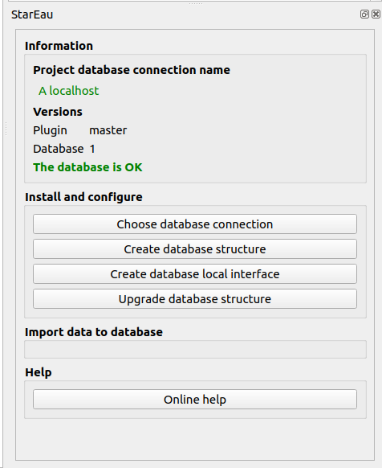

# StarEau plugin

    

* QGIS extension repository : https://github.com/3liz/qgis-stareau-plugin/releases/latest/download/plugins.xml
* QGIS extension documentation : https://docs.3liz.org/qgis-stareau-plugin/

This plugin allows you to manage data on underground water networks (sewage, stormwater, and drinking water) in accordance with the StaR'Eau geostandard.

Ce plugin permet de gérer les données de réseaux enterrés des eaux (usées, pluviales, potables) au géostandard StaR'Eau.

## Contributors

## Licence

GPL V2

## Setup
